# Architecture Diagrams

This document gives a diagram-first view of BrightBean Studio. It covers the
major runtime surfaces, background workers, data ownership, social integrations,
and publishing flows. For a deeper table-level ER view, see
[`db-architecture.md`](./db-architecture.md).

## System Context

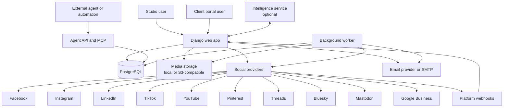

## Deployment Topology

The app runs best as at least two processes: one web process and one background
worker process. PostgreSQL is both the primary data store and the job queue for
`django-background-tasks`.

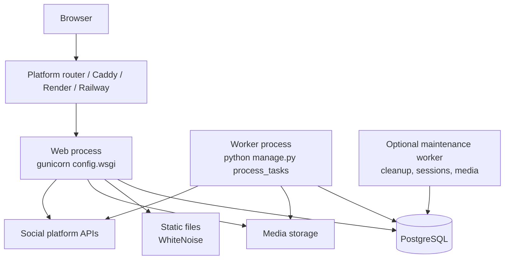

Common service commands:

| Service            | Command                                                 | Purpose                                                                |
| ------------------ | ------------------------------------------------------- | ---------------------------------------------------------------------- |
| Web                | `gunicorn config.wsgi:application --bind 0.0.0.0:$PORT` | Serves the UI, Agent API, MCP endpoint, webhooks, and admin.           |
| Worker             | `python manage.py process_tasks`                        | Polls PostgreSQL-backed background tasks, including the publish cycle. |
| One-shot publisher | `python manage.py run_publisher --once`                 | Diagnostic command for one publish polling cycle.                      |
| Inbox worker       | `python manage.py run_inbox_sync`                       | Optional polling worker for inbox sync/checks.                         |

## Application Modules

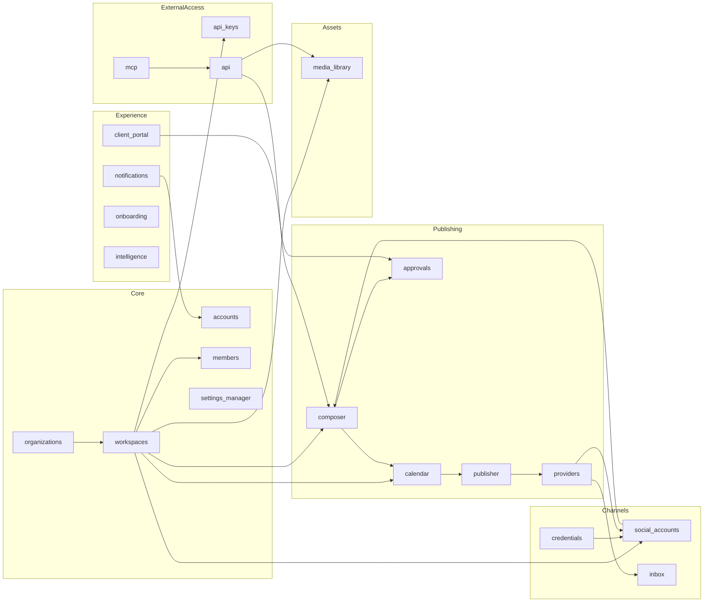

## Web Request Flow

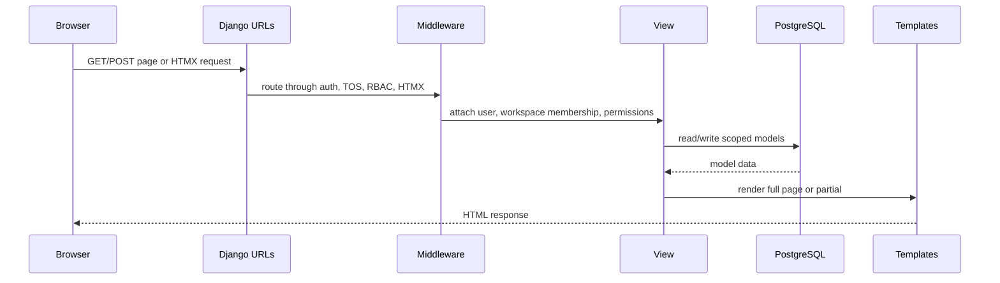

The frontend is mostly server-rendered Django templates. HTMX swaps partials for
composer actions, calendar updates, approvals, inbox views, and settings screens.
Alpine.js handles local interactions such as modals, dropdowns, and drag/drop.

## Data Ownership and Permissions

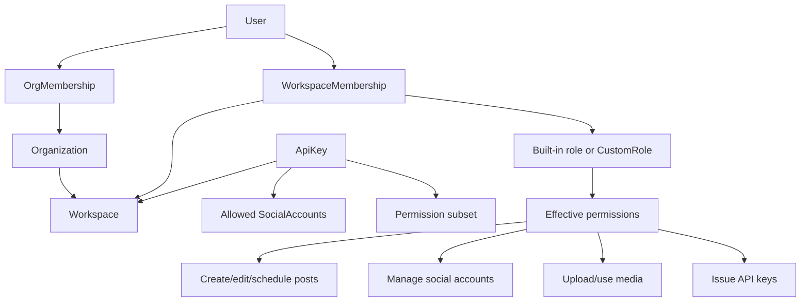

Data is scoped primarily by organization and workspace. API keys are additionally
restricted to one workspace and an explicit allowlist of connected social
accounts.

## Social Account Connection Flow

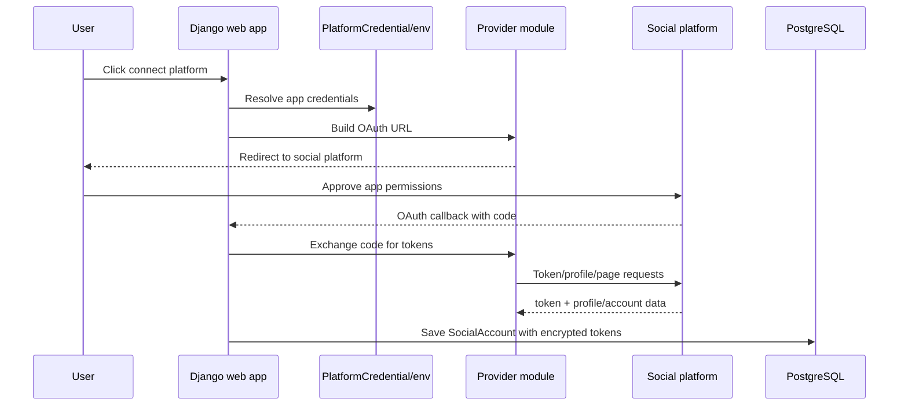

For Facebook, `SocialAccount.account_platform_id` stores the Page ID. During
publishing, the provider uses that value as `page_id`.

## Create, Schedule, Publish

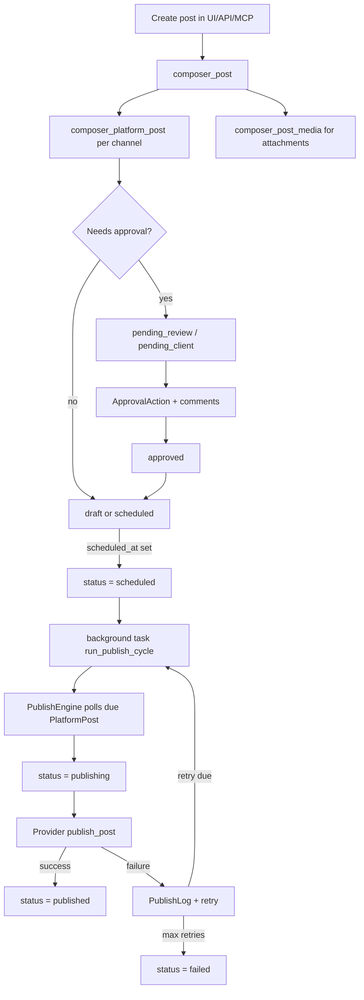

Key rule: the publisher does not publish `Post` rows directly. It publishes due
`PlatformPost` rows. This lets one base post target several social accounts,
with each channel having its own status, schedule, errors, and external post ID.

## Background Jobs

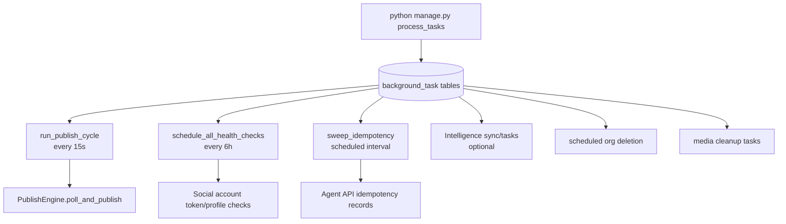

The worker is a long-running process. It is not triggered by web requests and is
not a platform cron job. It polls PostgreSQL for due background tasks.

## Media Pipeline

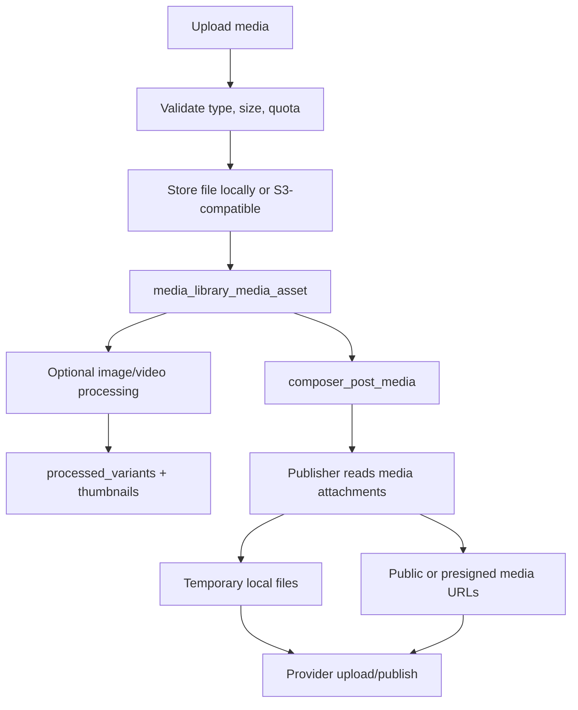

Providers use media differently. Some upload temporary files; some require
fetchable URLs. Production deployments using S3/R2 should ensure generated media
URLs are reachable by the target platform.

## Agent API and MCP

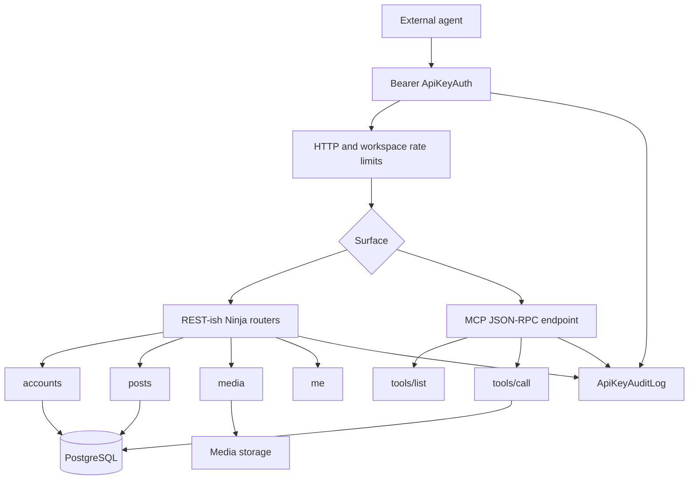

Both API styles use the same API key model, workspace scope, social-account
allowlist, rate limits, and audit log. MCP changes the wire protocol, not the
authorization model.

## Inbox and Webhooks

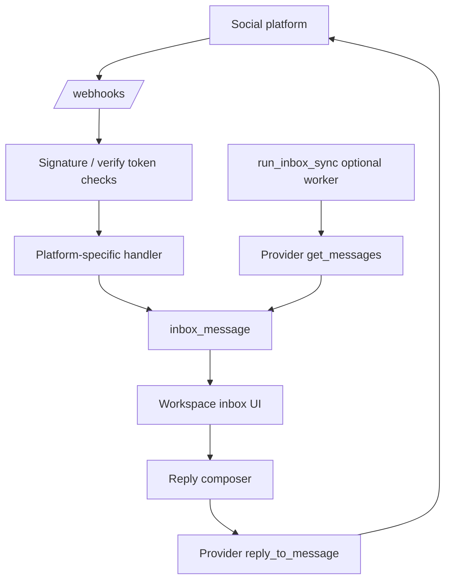

Some inbox events arrive by webhook, and some can be collected by the optional
polling sync worker. Replies go back through the same provider abstraction used
for publishing.

## Notifications and Approvals

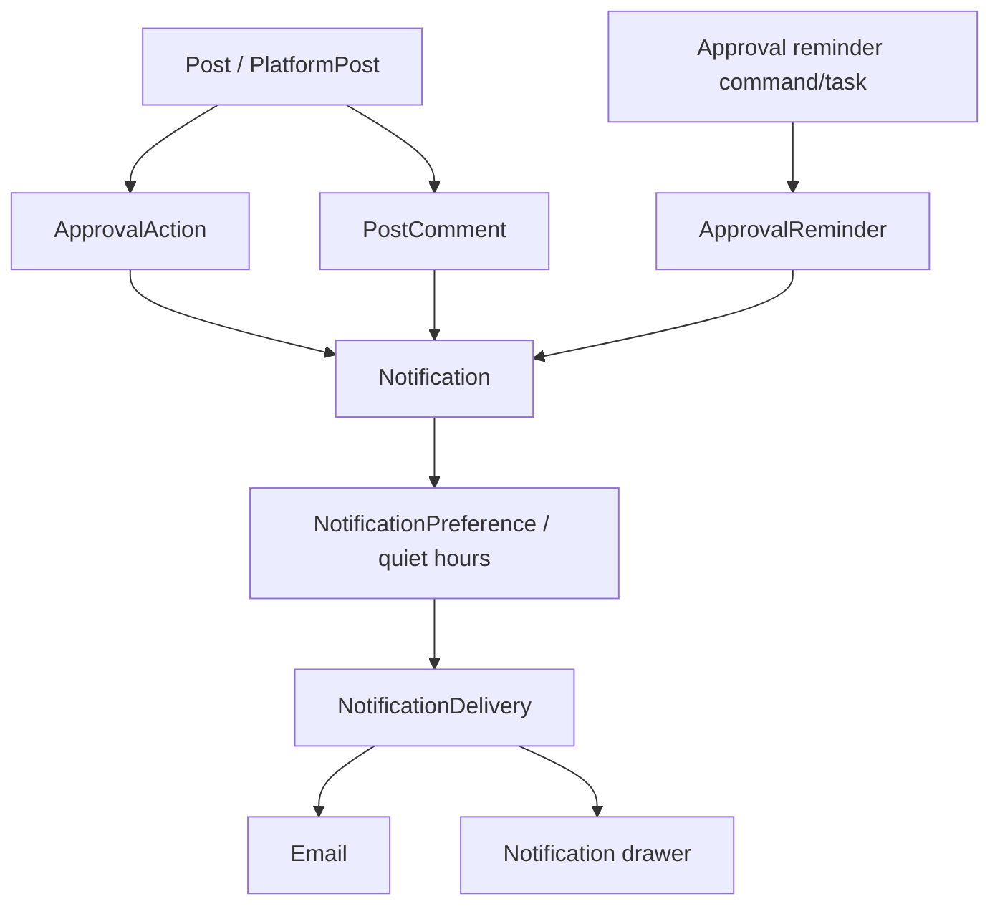

Approval state lives on `PlatformPost`; approval history and comments attach to
the base `Post`, optionally pointing at a specific `PlatformPost` when an action
targets one channel.

## Provider Abstraction

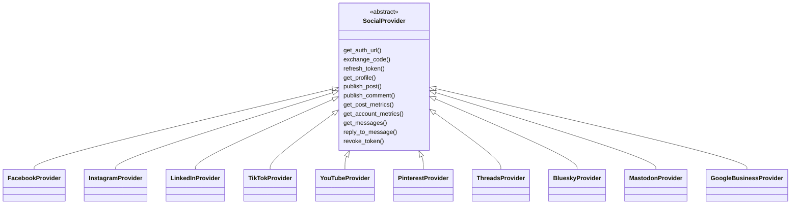

The publisher, inbox, analytics, and connection flows call the provider
interface instead of each platform directly. Adding a platform should primarily
mean adding a provider module, registering it, and exposing it through the
platform enum and UI.

## End-to-End Publishing Sequence

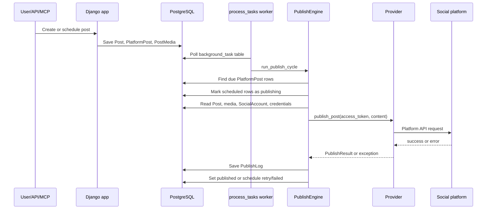
