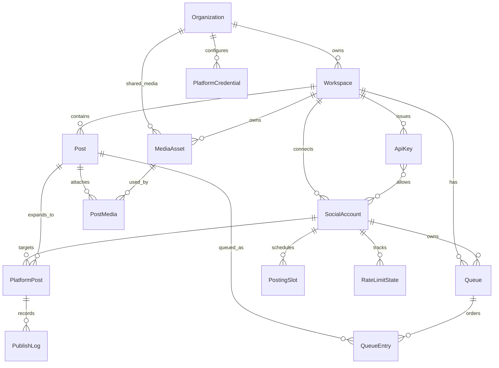
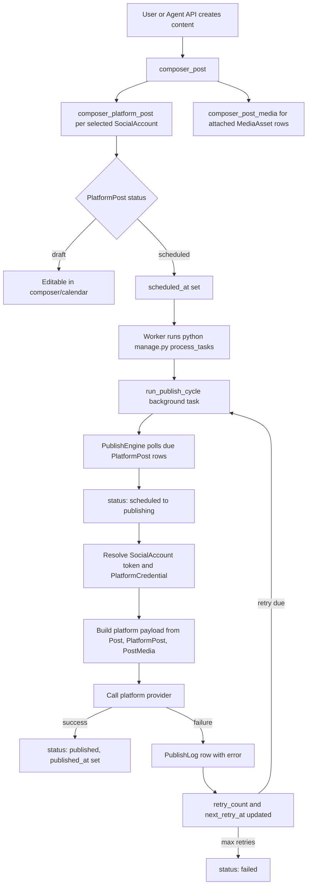
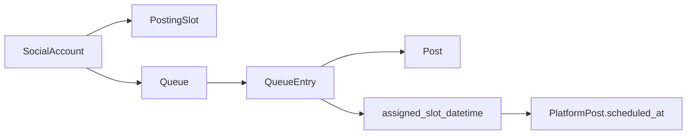
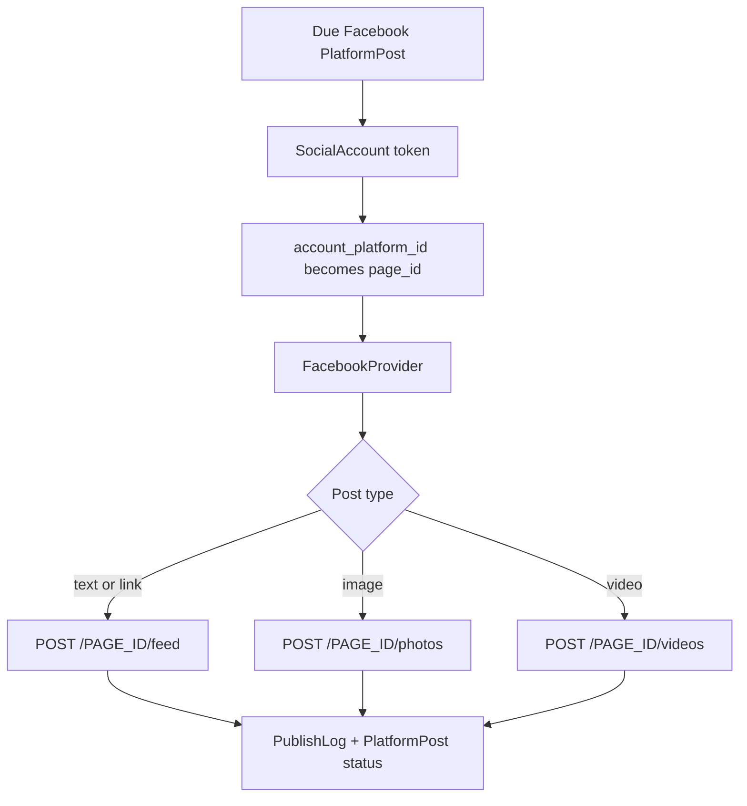

# Database Architecture

This document explains the core BrightBean Studio database shape for creating,
scheduling, and publishing posts to connected social channels. It is intentionally
focused on the posting and publishing path rather than every table in the app.

## Core Entity Relationship



## Main Tables

| Model | Table | Purpose |
| --- | --- | --- |
| `Organization` | `organizations_organization` | Top-level owner for workspaces, credentials, and shared media. |
| `Workspace` | `workspaces_workspace` | Operational space where posts, connected accounts, queues, and API keys live. |
| `PlatformCredential` | `credentials_platform_credential` | Org-level app credentials for platforms, falling back to environment credentials when absent. |
| `SocialAccount` | `social_accounts_social_account` | A connected social channel, such as a Facebook Page, with encrypted OAuth tokens. |
| `Post` | `composer_post` | Shared/base content: caption, title, first comment, tags, and aggregate schedule/published timestamps. |
| `PlatformPost` | `composer_platform_post` | Per-channel post variant and the source of truth for editorial/publishing status. |
| `MediaAsset` | `media_library_media_asset` | Uploaded image/video/GIF/document asset for an organization or workspace. |
| `PostMedia` | `composer_post_media` | Ordered join table connecting media assets to a post. |
| `PostingSlot` | `calendar_posting_slot` | Recurring default publish time for a connected social account. |
| `Queue` | `calendar_queue` | Named queue for a workspace/social account, optionally tied to a content category. |
| `QueueEntry` | `calendar_queue_entry` | A post's position inside a queue and computed assigned slot datetime. |
| `PublishLog` | `publisher_publish_log` | One row per publish attempt, including retries and platform errors. |
| `RateLimitState` | `publisher_rate_limit_state` | Per-account/platform rate limit state learned from platform API responses. |
| `ApiKey` | `api_keys_api_key` | Scoped Agent API credential tied to one workspace and an allowlist of social accounts. |

## Publishing Workflow



The important distinction is:

- `Post` is the shared content container.
- `PlatformPost` is the per-channel publish unit and owns the real status.
- `PublishLog` records every attempt, including failures and retries.

A single `Post` can have several `PlatformPost` rows. For example, one base
post can target Facebook, LinkedIn, and Instagram at different times. Each
channel can publish, fail, retry, or remain scheduled independently.

## Scheduling and Queueing



Queues are convenience scheduling tools. A queue calculates the next available
slot for a post, then keeps the matching `PlatformPost.scheduled_at` in sync.
The publisher itself does not publish queue entries directly; it only polls due
`PlatformPost` rows.

## Facebook Publishing Path

For Facebook, the data path to check is:

```text
social_accounts_social_account
  -> composer_platform_post
  -> publisher_publish_log
```

The Facebook-specific fields that matter most are:

| Table | Field | Meaning |
| --- | --- | --- |
| `social_accounts_social_account` | `platform` | Must be `facebook`. |
| `social_accounts_social_account` | `account_platform_id` | Facebook Page ID used as `page_id` during publish. |
| `social_accounts_social_account` | `oauth_access_token` | Encrypted token used by the Facebook provider. |
| `social_accounts_social_account` | `connection_status` | Should be `connected` for scheduling/publishing. |
| `composer_platform_post` | `status` | Must be `scheduled` before the worker picks it up. |
| `composer_platform_post` | `scheduled_at` | Must be due, or null with a due `composer_post.scheduled_at` fallback. |
| `composer_platform_post` | `publish_error` | Last publish error copied onto the platform post. |
| `publisher_publish_log` | `error_message` | Detailed error from the publish attempt. |
| `publisher_publish_log` | `response_body` | Truncated platform API response body. |

The Facebook provider injects `page_id` from
`SocialAccount.account_platform_id`. Depending on the content type, it then
calls the Facebook Graph API page feed, photos, or videos endpoint.



## Debugging Scheduled Posts

If a scheduled post does not publish, inspect in this order:

1. Confirm the worker process is running: `python manage.py process_tasks`.
2. Confirm a `composer_platform_post` row exists with `status = scheduled`.
3. Confirm `scheduled_at` is due, using UTC-aware timestamps.
4. Confirm the related `social_accounts_social_account.connection_status` is `connected`.
5. Check `publisher_publish_log` for the related `platform_post_id`.
6. For Facebook, check that the connected Page token has publish permission and
   `account_platform_id` is the Page ID.

No web request or cron trigger publishes scheduled posts directly. The long
running worker polls background tasks, and the publish cycle polls due
`PlatformPost` rows.
